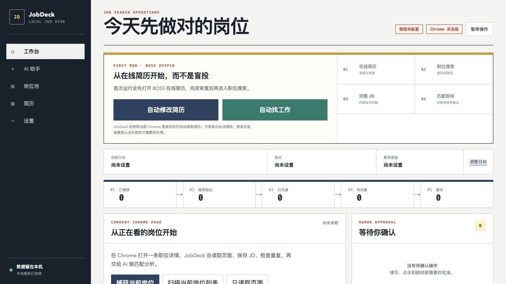
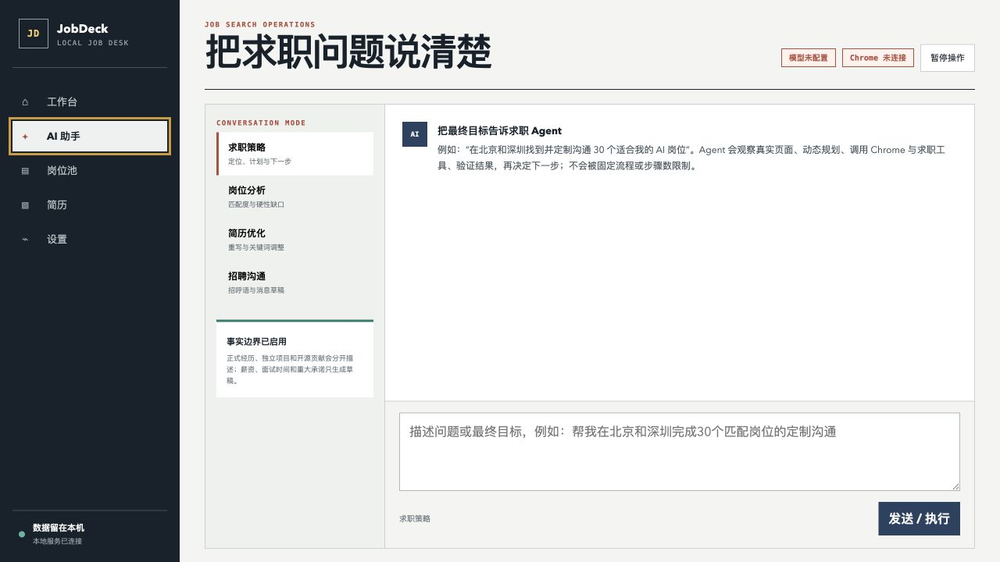

# JobDeck

JobDeck 是一个 self-hosted、local-Chrome 的 AI 求职 Agent。它把你自己掌控的 Web 工作台与用户自己的 Chrome 会话连接起来，让模型围绕最终目标持续执行“观察 → 规划 → 操作 → 验证”，而不是把求职过程写死成一组固定按钮。工作台既可在本机运行，也可部署到自己的服务器；浏览器操作始终由用户本机安装的扩展执行。

项目当前重点适配 BOSS 直聘，同时保留通用浏览器工具接口，便于继续增加其他招聘网站与求职动作。



## 能做什么

- 读取并审查在线简历，生成字段级优化稿。
- 通过 Chrome 扩展执行可见的点击、输入和保存，并回读页面验证结果。
- 直接读取 BOSS 已保存的求职期望，按其中的岗位与城市发现职位、读取完整 JD、去重并判断技术匹配。
- 针对每份 JD 生成不同的招呼语，执行沟通后验证发送结果。
- 在 AI 对话中直接下达目标，例如“在我的期望城市寻找并沟通 30 个匹配岗位”。
- 保存岗位、沟通、浏览器操作与 Agent 进度，支持暂停和恢复。

JobDeck 不读取 Chrome 的 Cookie 数据库，也不创建独立的自动化浏览器。招聘网站的登录态、扩展和个人资料仍由用户自己的 Chrome 管理。

## Agent 工作方式

Agent 运行时维护一个动态工具注册表。模型每轮只能选择一个工具，读取真实结果后再决定下一步：



```text
用户目标
   ↓
观察工作台、任务和 Chrome 页面
   ↓
模型选择一个已注册工具
   ↓
Chrome / 简历 / 岗位 / 沟通工具执行
   ↓
验证页面和任务进度
   └────────→ 未完成则重新规划
```

任务不会因为执行了固定数量的步骤而自动结束。只有达到可验证目标、用户暂停、需要本人决定，或遇到验证码、登录失效、页面歧义和平台限制时才停止。

## 本地启动

要求 Node.js 22 或更高版本。

```bash
npm install
npm start
```

打开 [http://127.0.0.1:43120](http://127.0.0.1:43120)。macOS 也可以双击 `scripts/start.command`。

## 安装 Chrome 扩展

1. 从 GitHub Releases 下载 `JobDeck-Chrome-Extension-*.zip` 并解压；开发者也可直接使用仓库的 `extension` 目录。
2. 打开 `chrome://extensions`，开启“开发者模式”。
3. 点击“加载已解压的扩展程序”，选择解压后的 `JobDeck-Chrome-Extension` 目录。
4. 固定“JobDeck 求职执行器”，打开侧边栏。
5. 启动本地工作台后，在侧边栏连接 JobDeck。
6. 首次访问招聘网站时，按站点授予访问权限。

使用远程工作台时，在扩展设置填写：

```text
Web 工作台：https://你的域名
执行通道：wss://你的域名/extension
插件连接码：登录工作台后，在“设置 → 当前账号”中复制
```

扩展通过 Chrome 的 `debugger` 权限调用输入协议。执行期间页面会显示 JobDeck 光标，Chrome 也会显示调试提示；任务暂停或单步完成后会释放控制。

## 首次配置

在工作台中完成三项设置：

1. 候选人事实：求职状态、已核实经历与技术证据；岗位、城市和薪资范围直接在 BOSS 求职期望中管理。
2. 本地简历：自行选择 PDF 或填写简历正文。个人附件默认不会进入 Git 仓库。
3. 模型连接：填写 OpenAI Responses 或 OpenAI-compatible Chat 接口、模型名称和 API Key。

设置页还可以直接使用邮箱注册或登录 OnPeople AI 账号。该流程不依赖 Google、GitHub 或其他 OAuth；密码只经由 JobDeck 服务即时转发给账号服务，不会写入 JobDeck 数据文件，登录令牌只保留在当前浏览器会话中。

默认接口地址是 `https://api.openai.com/v1`。也可以使用自建或兼容服务，但远程地址必须使用 HTTPS。

本机运行时，API Key 保存在：

```text
~/.jobdeck-local/secrets.json
```

密钥不会返回给 Web 页面或 Chrome 扩展。

## 部署到服务器

推荐使用带域名的 Linux 服务器。远程扩展连接必须使用 HTTPS/WSS；仓库中的 Caddy 会自动申请并续期证书，同时代理 WebSocket。

```bash
git clone https://github.com/userInner/JobDeck.git
cd JobDeck
cp .env.example .env
```

编辑 `.env`，把域名改成已经解析到服务器的域名，并保留 `JOBDECK_MULTI_USER=true`。公网工作台使用 Sub2API 邮箱账号登录，不再共用一个部署访问令牌。

然后启动：

```bash
docker compose --env-file .env -f deploy/compose.https.yaml up -d --build
```

服务器需要开放 TCP 80、TCP 443 和 UDP 443。运行数据保存在 Docker 的 `jobdeck_data` 卷中；更新代码后重新执行上述启动命令即可。建议同时备份该卷，并妥善保存 `.env`。

### 启用 GitHub Star 奖励

在 `.env` 中配置 Sub2API 管理密钥后，可以给已验证 Star 的 AI 账号一次性发放额度：

```text
SUB2API_BASE_URL=https://sub2api.aibro.vip
SUB2API_ADMIN_API_KEY=你的服务端管理密钥
GITHUB_REPOSITORY=userInner/JobDeck
STAR_REWARD_USD=5
GITHUB_TOKEN=可选的服务端 GitHub Token
```

领取者登录 AI 账号后填写 GitHub 用户名，并上传仓库已 Star 的 PNG、JPEG 或 WebP 截图。JobDeck 会核对公开 Star、截图指纹、AI 账号和历史奖励流水，全部通过后调用 Sub2API 管理接口加 $5。服务器只记录截图哈希、格式和大小，不保存截图原图。每个 GitHub 账号和 AI 账号只能领取一次；稳定的幂等编号可防止网络重试导致重复加款。`SUB2API_ADMIN_API_KEY` 和可选的 `GITHUB_TOKEN` 仅保存在服务器环境中，绝不会返回给 Web 页面。

相关接口：

```text
GET  /api/account/config
POST /api/account/send-code
POST /api/account/register
POST /api/account/login
GET  /api/account/me
POST /api/rewards/github-star/challenge
POST /api/rewards/github-star/claim
POST /api/rewards/github-star/screenshot
```

安全约束：

- 多用户模式下，工作台数据 API 必须携带有效的 Sub2API Access Token；每个 `user_id` 映射到独立的状态、模型密钥、岗位、Agent 和浏览器桥接空间。
- 每个账号生成独立插件连接码。扩展与服务端通过 WSS 连接，连接码放在 WebSocket 子协议中，不放在页面 URL。
- 单个 Chrome 插件连接只能进入连接码所属账号的空间，不能读取其他用户数据或占用其他用户的浏览器会话。
- 不要把 `.env`、模型 API Key、简历或求职数据提交到 GitHub。

如果已经有 1Panel、OpenResty、Nginx、Traefik 或 Cloudflare Tunnel，可以使用不会占用公网 80/443 的配置：

```bash
docker compose --env-file .env -f deploy/compose.existing-proxy.yaml up -d --build
```

该配置只监听 `127.0.0.1:43120`。请让现有 HTTPS 反向代理把整个站点转发到 `http://127.0.0.1:43120`，并确保支持 WebSocket Upgrade。

## BOSS 直聘适配

专用适配器会识别以下页面：

- 在线简历：读取简历区块、生成优化稿、定位编辑入口并验证保存结果。
- 职位列表：直接读取并切换 BOSS 已保存的求职期望，提取候选卡片并本地去重。
- 职位详情：读取标题、公司、地点、薪资、招聘者与完整 JD。
- 沟通页面：读取最近消息、生成安全回复或发送经过授权的定制招呼。

页面结构变化时，Agent 会重新观察并尝试安全的替代动作；无法唯一判断控件时不会猜测点击。

## 安全边界

- 不读取 Chrome 个人资料目录、Cookies 数据库、系统钥匙串或其他扩展数据。
- 不填写密码、验证码、身份证、银行卡、助记词、私钥等敏感信息。
- 不绕过验证码、风控、频率限制或平台规则。
- 不把独立项目和开源贡献伪装成正式工作，也不虚构用户数、营收、团队规模和从业年限。
- 薪资谈判、具体面试时间、Offer、合同、隐私和重大承诺必须由本人确认。
- 对外发送和批量任务必须有明确授权；遇到异常会暂停并保留进度。

## 本地数据

本机运行时，数据默认保存在：

```text
~/.jobdeck-local/state.json
~/.jobdeck-local/secrets.json
~/.jobdeck-local/star-rewards.json
```

公网多用户模式下，每个账号的数据位于 `/data/tenants/tenant-<user_id 哈希>/`，目录内分别保存 `state.json` 与 `secrets.json`；原始用户编号只记录在受保护的租户元数据中。Star 奖励流水位于实例级 `/data/star-rewards.json`，用于阻止跨账号重复领取。当前部署方案面向单个 JobDeck 服务副本；横向扩容前需要把租户索引和奖励流水迁移到共享数据库。

删除该目录会清空本地状态。工作台支持导出不含密钥的数据。

## 开发与测试

### 设计系统

Web 工作台与 Chrome 扩展统一遵循 [JobDeck Quiet UI 设计规范](docs/DESIGN_SYSTEM.md)。颜色、字号、间距、圆角、焦点和动效由 `web/design-tokens.css` 与 `extension/design-tokens.css` 提供；两份 token 必须保持一致，自动测试会阻止视觉基础悄悄分叉。

```bash
npm run check
npm run smoke
```

主要目录：

```text
extension/   Chrome 扩展、Computer Use 与 BOSS 页面适配
server/      本地服务、Agent 运行时、模型和任务状态
web/         Web 工作台
test/        Node.js 回归测试
scripts/     启动与冒烟测试
deploy/      Docker Compose 与自动 HTTPS 配置
```

生成扩展安装包：

```bash
npm run package:extension
```

产物位于 `dist/`，发布到 GitHub Release，而不进入 Git 历史。

## 当前状态

JobDeck 仍处于早期开发阶段。招聘网站 DOM 和交互会频繁变化，提交 Issue 时请提供页面类型、可复现步骤、扩展版本和脱敏截图，不要上传简历、聊天记录、API Key 或其他个人信息。

## License

[MIT](LICENSE)
